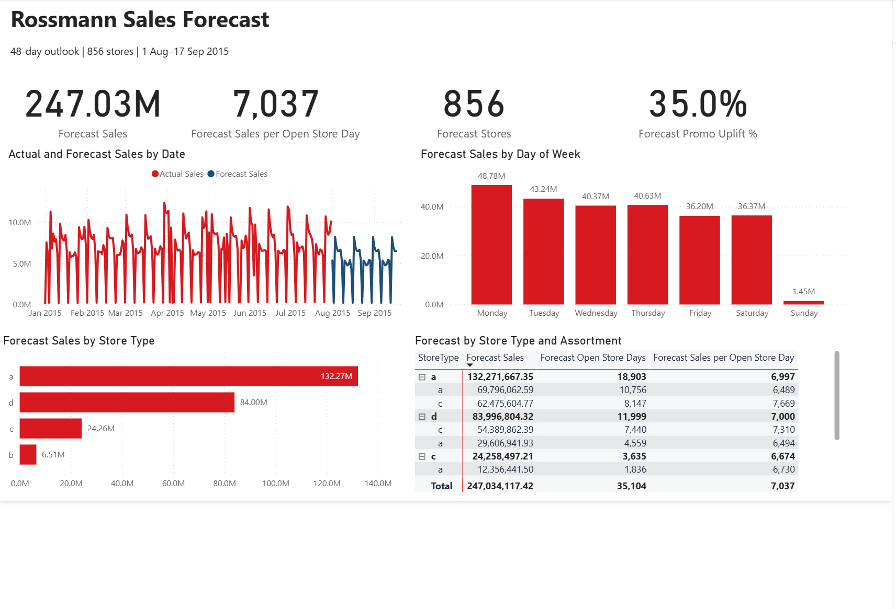
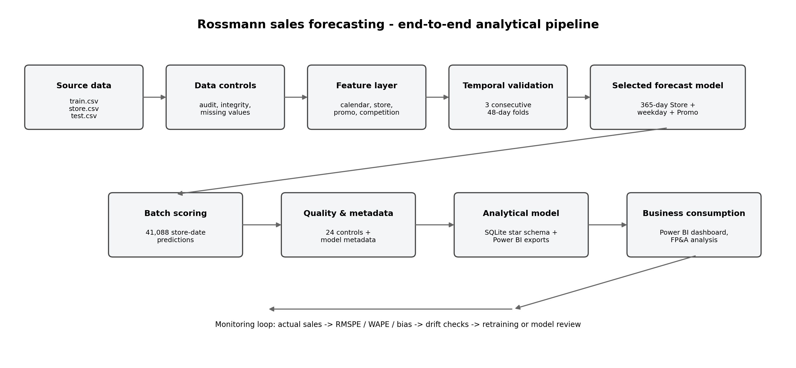
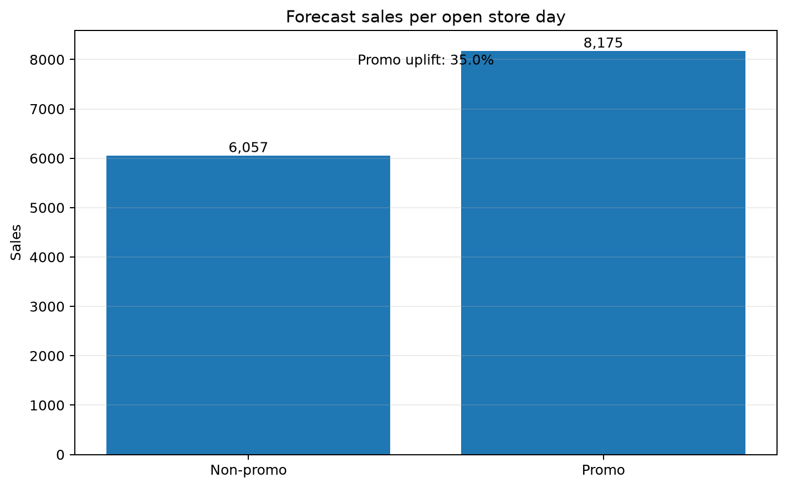
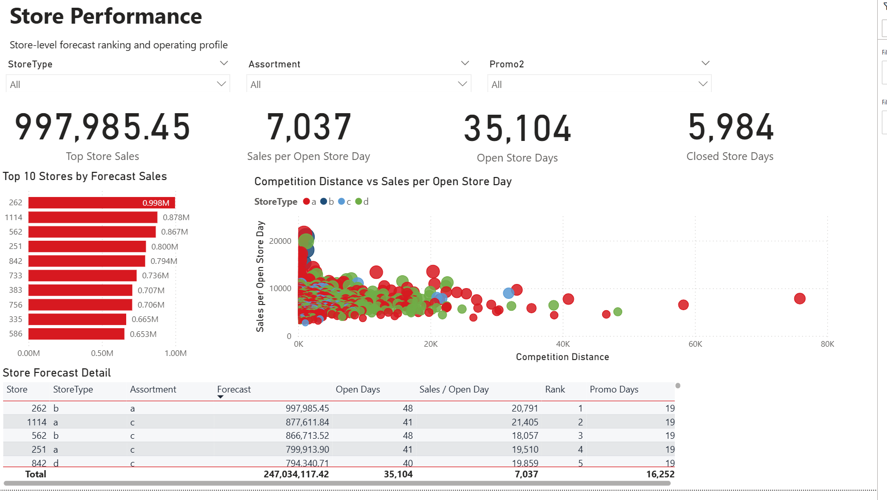
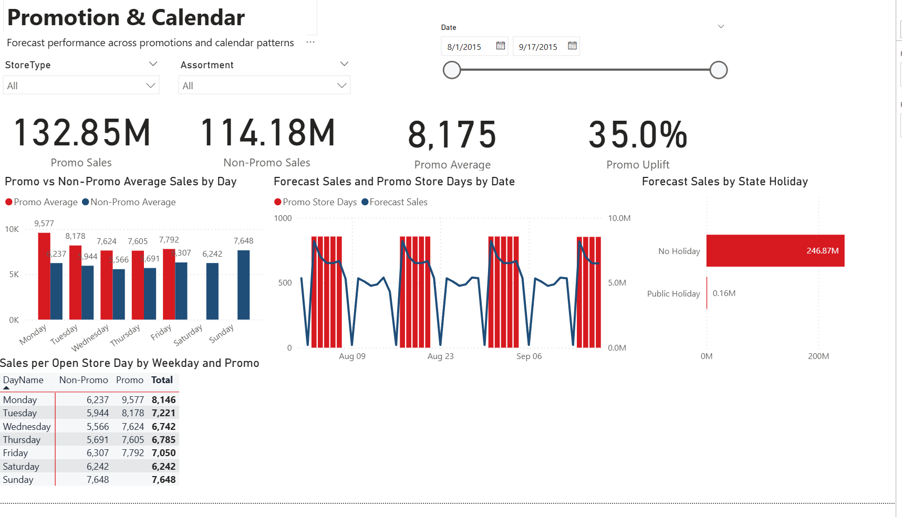
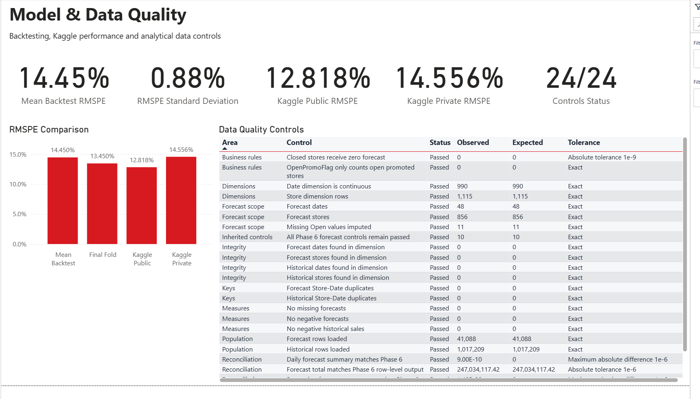

# Rossmann Retail Sales Forecasting & FP&A Analytics

Proyecto end-to-end de forecasting para predecir las ventas diarias de cada tienda Rossmann y traducir los resultados a información útil para planificación operativa, FP&A y business controlling mediante Python, SQL y Power BI.



## Resumen ejecutivo

El proyecto pronostica las ventas de **856 tiendas durante un horizonte de 48 días**, entre el **1 de agosto y el 17 de septiembre de 2015**. El modelo seleccionado utiliza los 365 días más recientes y segmenta el histórico por tienda, día de la semana y estado promocional.

| Métrica | Resultado |
|---|---:|
| Ventas previstas | 247.034.117,42 |
| Filas previstas | 41.088 |
| Tiendas | 856 |
| Días de tienda abierta | 35.104 |
| RMSPE medio en tres folds temporales | 14,45 % |
| Desviación estándar del RMSPE | 0,88 % |
| Kaggle Public RMSPE | 12,818 % |
| Kaggle Private RMSPE | 14,556 % |
| Controles de calidad aprobados | 24 / 24 |

El resultado privado de Kaggle fue prácticamente igual al backtest temporal medio, lo que confirmó externamente que la estrategia de validación era representativa.

## Problema de negocio

Los responsables de tienda necesitan una previsión fiable para planificar personal, promociones, tesorería, inventario y reporting. La unidad de predicción es:

> Ventas diarias por tienda y fecha.

El proyecto responde a cuatro preguntas:

1. ¿Cuánto se prevé vender durante los próximos 48 días?
2. ¿Qué tiendas, días de la semana y formatos explican el forecast?
3. ¿Cómo cambia la previsión entre días promocionales y no promocionales?
4. ¿Qué fiabilidad tiene el modelo y cómo podría operarse en producción?

## Datos

Se utilizan los archivos públicos de la competición Rossmann Store Sales:

- `train.csv`: 1.017.209 registros históricos.
- `store.csv`: maestro de 1.115 tiendas.
- `test.csv`: 41.088 combinaciones futuras para 856 tiendas.
- `sample_submission.csv`: estructura exigida por Kaggle.

Los datos originales no deben distribuirse desde el repositorio. Las instrucciones de descarga están en `data/raw/README.md`.

## Arquitectura del sistema



La solución integra:

- auditoría y controles de calidad;
- ingeniería de características sin fuga de información;
- validación cronológica;
- comparación de modelos y estabilidad temporal;
- scoring final por lotes;
- modelo analítico SQL;
- dashboard interactivo de Power BI;
- diseño conceptual de monitorización y reentrenamiento.

## Auditoría y preparación

La auditoría confirmó una fila única por tienda y fecha, continuidad del calendario e integridad referencial. Las principales decisiones fueron:

- `Sales` es la variable objetivo.
- `Customers` se excluye como predictor de producción porque no existe en test y no estaría disponible al crear el forecast.
- La validación es cronológica, no aleatoria.
- El test de Kaggle se reserva para el scoring final.
- Los 11 valores ausentes de `Open` de Store 622 se imputan como abiertos y se conserva una bandera de trazabilidad.
- Las tiendas cerradas reciben forecast cero.

La ingeniería de variables incluye calendario, atributos de tienda, competencia, Promo2 y controles de disponibilidad de información.

## Estrategia de validación

Para evitar que un único periodo favorezca accidentalmente a un modelo, la comparación final utiliza **tres folds consecutivos de 48 días**, siempre sobre las 856 tiendas del test.

La métrica principal es **RMSPE**, acompañada de MAE, RMSE, WAPE y bias. El RMSPE es adecuado porque mide el error proporcional entre tiendas con escalas de venta diferentes y coincide con la métrica de Kaggle.

## Modelos probados

Se compararon referencias históricas transparentes y modelos de Machine Learning:

- media global en tiendas abiertas;
- media por tienda;
- media por tienda y día de la semana;
- media por tienda, día de la semana y promoción;
- Ridge con ventas directas y `log1p(Sales)`;
- HistGradientBoosting con TargetEncoder, en escala directa y logarítmica;
- versiones recientes de 180 y 365 días;
- modelo residual y blends entre baseline y residual.

El mejor baseline de la Fase 4 fue `Store + weekday + Promo`, con un RMSPE aproximado de 0,1449 en el último holdout.

## Selección del modelo final

El modelo seleccionado es:

> **Recent 365-day Store + weekday + Promo**

Para cada fila de una tienda abierta, utiliza la media reciente correspondiente a la misma tienda, día de la semana y estado promocional. Si no existe la combinación exacta, aplica este fallback:

1. tienda + día de la semana;
2. tienda;
3. media global de tiendas abiertas.

El blend 50 % baseline / 50 % residual obtuvo un RMSPE medio ligeramente inferior, 0,1442, pero no se seleccionó porque mostró mayor variabilidad entre folds. El modelo final ganó dos de los tres periodos y obtuvo el mejor resultado en el último fold.

## Explicabilidad

El modelo final es intrínsecamente interpretable. Cada predicción puede trazarse a un grupo histórico reciente y a un nivel concreto de fallback.

Los principales drivers están incluidos directamente en su estructura:

- **Store** recoge patrones locales persistentes.
- **DayOfWeek** representa el ciclo semanal.
- **Promo** diferencia días promocionales y no promocionales.
- **Open** aplica una regla de negocio: una tienda cerrada recibe forecast cero.

La previsión media por día abierto es de aproximadamente **8.175 con promoción** y **6.057 sin promoción**, lo que supone un uplift descriptivo cercano al **35,0 %**. No debe interpretarse como una estimación causal del retorno de una promoción.



El notebook `notebooks/09_explainability_business_impact.ipynb` formaliza esta interpretación y genera los indicadores finales de negocio.

## Resultados empresariales

El forecast total asciende a **247,03 millones**.

Principales conclusiones:

- los días promocionales representan aproximadamente el 53,8 % de las ventas previstas y el 46,3 % de los días abiertos;
- Monday concentra el mayor forecast y la mayor venta media por tienda abierta;
- Store 262 lidera el forecast con aproximadamente 997.985,45;
- las diez primeras tiendas representan alrededor del 3,16 % del total, por lo que el forecast está distribuido entre una red amplia y no depende de unas pocas tiendas.

## Dashboard de Power BI

### 1. Executive Forecast


### 2. Store Performance



### 3. Promotion & Calendar



### 4. Model & Data Quality



El informe se encuentra en `powerbi/rossmann_sales_forecast_dashboard.pbix`.

## Modelo analítico SQL

La Fase 7 construye una base SQLite y exportaciones preparadas para Power BI. El modelo en estrella contiene:

- `dim_date`;
- `dim_store`;
- `fact_sales_history`;
- `fact_sales_forecast`;
- `model_metrics`;
- `data_quality_results`.

El proceso ejecuta 24 controles sobre población, integridad, reglas de negocio y reconciliación.

## Producción conceptual

La solución se desplegaría como un **proceso batch**, porque la necesidad es actualizar un horizonte de planificación de varias semanas, no responder peticiones individuales en tiempo real.

El flujo propuesto:

1. ingerir ventas diarias, maestro de tiendas, aperturas y calendario promocional;
2. ejecutar controles de esquema, completitud e integridad;
3. recalcular los agregados móviles de 365 días;
4. generar semanalmente un forecast renovado de seis semanas;
5. publicar outputs versionados en la base analítica y Power BI;
6. comparar el forecast con los datos reales cuando estén disponibles.

La revisión del modelo podría realizarse mensualmente y activarse antes si:

- empeoran de forma material RMSPE o WAPE;
- aparece un bias persistente;
- cambian los patrones de apertura, promoción o mix de tiendas;
- se incorporan nuevas tiendas o se produce un cambio estructural.

El diseño detallado está en `docs/phase_9_production_design_ES.md`.

## Reproducibilidad

Crear el entorno:

```bash
conda env create -f environment.yml
conda activate rossmann-forecasting
python -m ipykernel install --user --name rossmann-forecasting --display-name "Python (rossmann-forecasting)"
```

Ejecutar los notebooks:

```text
01_data_audit.ipynb
02_eda.ipynb
03_feature_engineering.ipynb
04_baseline_models.ipynb
05_model_improvement.ipynb
06_final_forecast_submission.ipynb
07_sql_data_model.ipynb
09_explainability_business_impact.ipynb
```

Construir el modelo SQL desde la raíz:

```bash
python -m src.build_sql_model
```

Principales outputs:

```text
reports/submissions/rossmann_submission_recent365.csv
reports/tables/final_test_forecast.csv
models/final_model_metadata.json
data/processed/rossmann_analytics.db
powerbi/rossmann_sales_forecast_dashboard.pbix
```

## Estructura del repositorio

```text
data/          datos raw, interim y processed
docs/          guías, decisiones, arquitectura y producción
models/        metadata del modelo final
notebooks/     flujo analítico reproducible
powerbi/       dashboard, tema y medidas DAX
reports/       figuras, tablas y submission
sql/           tablas, vistas, consultas y controles
src/           módulos reutilizables
```

## Limitaciones y mejoras futuras

- No existen datos de precios, mix de producto, meteorología o eventos locales.
- El uplift promocional es descriptivo y no causal.
- La identidad de tienda captura diferencias locales, pero no explica sus causas socioeconómicas.
- Las tiendas nuevas dependen más de los fallbacks por disponer de poco histórico.
- Un futuro challenger podría combinar el baseline con un residual más estable y aplicar SHAP o permutation importance.
- Los intervalos de predicción y los escenarios mejorarían la planificación bajo incertidumbre.

## Conclusión

El proyecto demuestra un proceso end-to-end que prioriza validez temporal, reproducibilidad y utilidad empresarial. El modelo final es transparente y estable, Kaggle confirma externamente el backtest y la capa SQL/Power BI convierte predicciones fila a fila en un producto analítico auditable.
