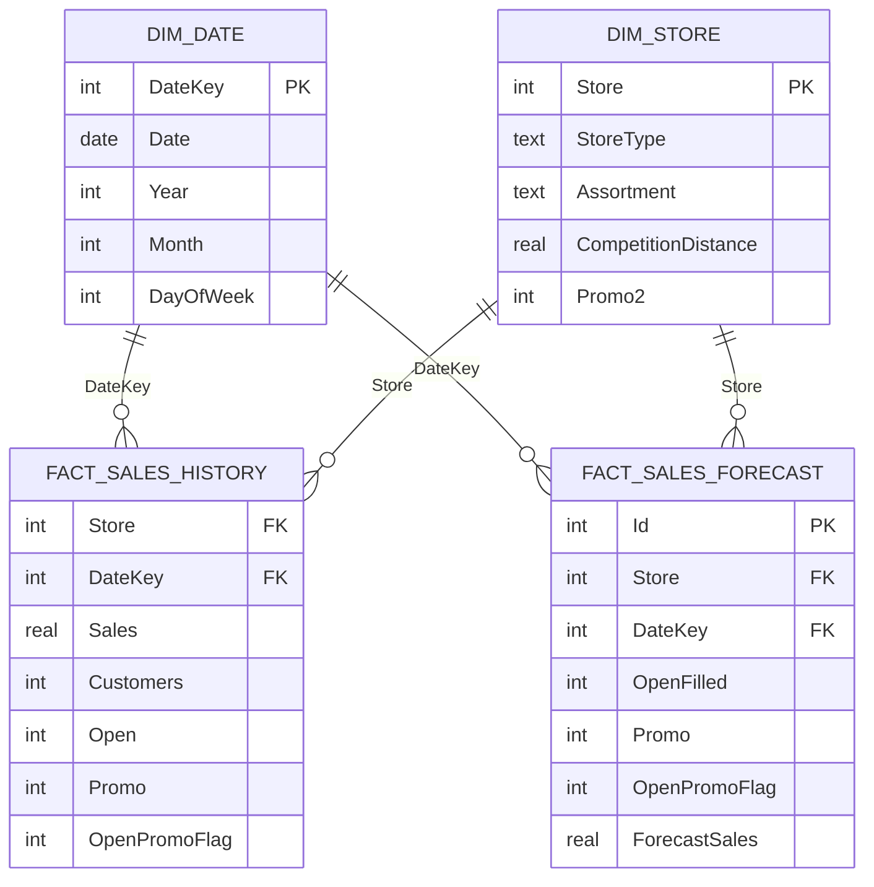

# Diccionario de datos — Fase 7

## Modelo en estrella

## Relaciones

| Tabla origen | Columna | Tabla destino | Columna | Cardinalidad |
|---|---|---|---|---|
| `dim_date` | `DateKey` | `fact_sales_history` | `DateKey` | 1 a muchos |
| `dim_store` | `Store` | `fact_sales_history` | `Store` | 1 a muchos |
| `dim_date` | `DateKey` | `fact_sales_forecast` | `DateKey` | 1 a muchos |
| `dim_store` | `Store` | `fact_sales_forecast` | `Store` | 1 a muchos |

En Power BI, las relaciones deben tener dirección de filtro simple desde las dimensiones hacia los hechos.

## `dim_date`

**Granularidad:** una fila por día desde 2013-01-01 hasta 2015-09-17.

| Campo | Tipo | Descripción |
|---|---|---|
| `DateKey` | entero | Clave `YYYYMMDD`. |
| `Date` | fecha | Fecha de calendario. |
| `Year` | entero | Año. |
| `Quarter` | entero | Trimestre numérico 1–4. |
| `QuarterLabel` | texto | Etiqueta `Q1`–`Q4`. |
| `Month` | entero | Mes 1–12. |
| `MonthName` | texto | Nombre del mes en inglés. |
| `YearMonth` | texto | Periodo `YYYY-MM`. |
| `ISOWeek` | entero | Semana ISO. |
| `DayOfMonth` | entero | Día del mes. |
| `DayOfWeek` | entero | Día Rossmann: lunes=1, domingo=7. |
| `DayName` | texto | Nombre del día en inglés. |
| `IsWeekend` | entero | 1 para sábado o domingo. |

## `dim_store`

**Granularidad:** una fila por tienda; 1.115 tiendas.

Contiene los atributos originales de `store.csv`, además de `CompetitionOpenDate` y `Promo2StartDate`, calculadas cuando el año y el mes o semana están disponibles.

## `fact_sales_history`

**Granularidad:** una fila por tienda y fecha histórica.

| Campo | Tipo | Descripción |
|---|---|---|
| `Store` | entero | Clave foránea de tienda. |
| `DateKey` | entero | Clave foránea de fecha. |
| `Sales` | real | Ventas observadas. |
| `Customers` | entero | Clientes observados. |
| `Open` | entero | Indicador de tienda abierta. |
| `Promo` | entero | Indicador promocional original. |
| `OpenPromoFlag` | entero | 1 únicamente cuando la tienda está abierta y en promoción. |
| `StateHoliday` | texto | Código de festivo estatal. |
| `SchoolHoliday` | entero | Indicador de vacaciones escolares. |

## `fact_sales_forecast`

**Granularidad:** una fila por tienda y fecha del horizonte de test; 41.088 filas, 856 tiendas y 48 días.

| Campo | Tipo | Descripción |
|---|---|---|
| `Id` | entero | Identificador original de Kaggle. |
| `Store` | entero | Clave foránea de tienda. |
| `DateKey` | entero | Clave foránea de fecha. |
| `OpenOriginal` | real | Valor original de `Open`, incluidos los 11 ausentes. |
| `OpenFilled` | entero | Valor utilizado tras la imputación. |
| `OpenMissingFlag` | entero | Identifica las 11 imputaciones de Store 622. |
| `Promo` | entero | Indicador promocional. |
| `OpenPromoFlag` | entero | Promoción únicamente en tiendas abiertas. |
| `StateHoliday` | texto | Código de festivo estatal. |
| `SchoolHoliday` | entero | Indicador de vacaciones escolares. |
| `Promo2Active` | entero | Indicador de Promo2 activa en la fecha. |
| `BaselineRecent365` | real | Predicción del modelo seleccionado. |
| `ForecastSales` | real | Forecast final, cero para tiendas cerradas. |
| `ModelName` | texto | Nombre del modelo de la Fase 6. |

## `model_metrics`

**Granularidad:** una fila para el modelo final.

Documenta el periodo histórico, la ventana real desde 2014-08-01, el horizonte de forecast, RMSPE del backtest, desviación estándar, scores de Kaggle, reglas de tiendas cerradas e imputación de `Open`.

## `data_quality_results`

**Granularidad:** una fila por control ejecutado.

Permite auditar población, claves, integridad referencial, reglas de negocio y reconciliaciones con las tablas finales de la Fase 6.
